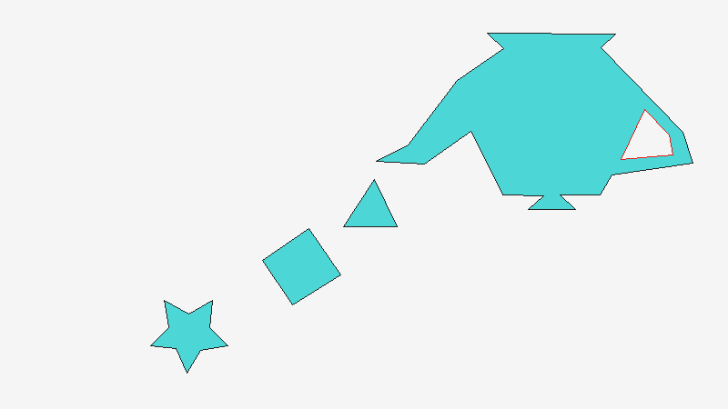

# Lab 1: Filling any polygon

Algoritmo de relleno de polígonos (scanline fill, regla par-impar).

## Cómo correrlo

```bash
zig build run
```

Esto genera `out.bmp` en la raíz del proyecto con los 5 polígonos pedidos, incluyendo el Polígono 4 con el agujero del Polígono 5 (que no se rellena).

## Estructura

- `src/bmp.zig`: framebuffer, escritura de BMP, dibujo de líneas (Bresenham) y relleno de polígonos (scanline fill).
- `src/main.zig`: define los polígonos y arma la imagen final.

## Resultado


